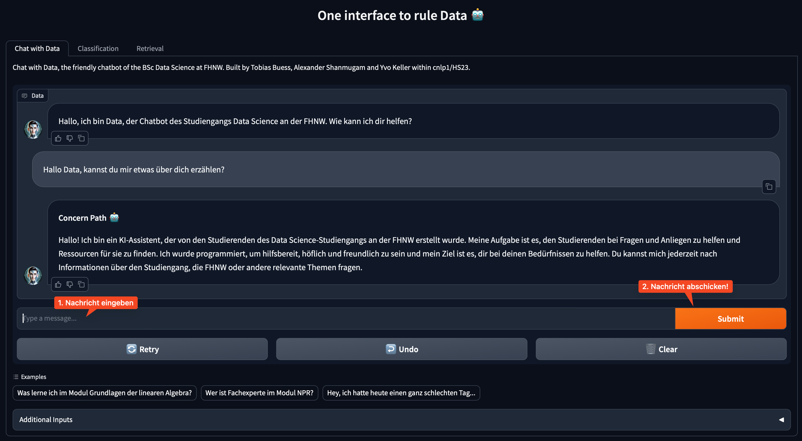
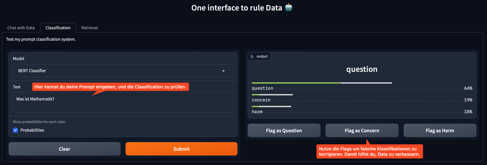
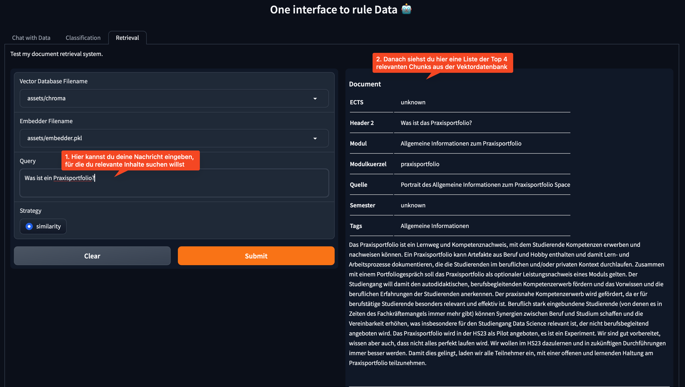

# Chatbot Data 🤖

This repository hosts the implementation of our Chatbot Data. It is based on a Gradio Dashboard.

The **Documentation** the best entry point to fully understanding the project. You can read it [here](docs/DOCUMENTATION.md).

## Repository Structure

The repository is structured as follows:

```markdown
└── 📁Study-Bot
    └── .env.template [ℹ️ Template for the .env file]
    └── README.md
    └── requirements.txt
    └── 📁assets [ℹ️ Assets used in README.md and docs]
    └── 📁docs [ℹ️ Contains our documentation markdowns]
    └── 📁src
        └── .DS_Store
        └── README.md
        └── 📁assets [ℹ️ Assets used in the Gradio Dashboard]
            └── ...
            └── 📁chroma [ℹ️ ChromaDB Vector Store with all Chunks]
            └── embedder.pkl [ℹ️ Embedder used for retrieval querying]
        └── dashboard.py [ℹ️ Gradio Dashboard Script]
        └── 📁flagged [ℹ️ Results flagged in Gradio]
        └── tools.py
```

## Setup

### Prerequisites

1. **Clone the Repository**: Clone this repository to your local machine.
2. **Python Environment**: Create a new virtual Python environment to ensure isolated package management (we used Python 3.11.6).
3. **Installation**: Navigate to the repository's root directory and install the required packages:
   ```bash
   pip install -r requirements.txt
   ```

### Configuring Environment Variables

1. **Environment File**: Copy `.env.template` to a new file named `.env`.
2. **API Keys**: Add your API keys and tokens in the `.env` file:
   ```
   HF_ACCESS_TOKEN=your-token-here
   OPENAI_API_KEY=your-key-here
   ```
   Replace `your-token-here` and `your-key-here` with your actual Hugging Face and OpenAI API keys.

### Running the Chatbot Data 🤖

Make sure to add the current embedder as `embedder.pkl` and the chroma vector db folder `chroma` produced by the DVC pipeline in the [Question Answering] (https://github.com/NLP-Challenges/llm-qa-path) repository to `src/assets/` before running the dashboard. 

Then, to run the dashboard, execute the following command:

```bash
python src/dashboard.py
```

This will load all required models onto the GPU and start the Gradio dashboard. You can now access the dashboard at `http://localhost:7860/`, or the public link provided in the terminal.

## Using Data

You can chat with Data via the Gradio Dashboard. In this section, we'll go over how you use it to chat with Data, and to debug and understand Data's behavior (be it for educational purposes or for helping improve it).

How it works in the background: Data first utilizes the classifier to determine the type of the user input. If the input is a question, it is passed to the [Question Answering](https://github.com/NLP-Challenges/Study-Bot/blob/main/docs/DOCUMENTATION.md#step-2-question-answering) module, which retrieves relevant contex and generates the answer. If the input is a concern, the [Concern Path](https://github.com/NLP-Challenges/Study-Bot/blob/main/docs/DOCUMENTATION.md#step-3-concern-path) is triggered, which generates an appropriate messasge to continue the conversation. If the input is harm, the chatbot responds with a predefined message that denies response to the user.

### Tab 1: Chat

In the chat tab, you can talk to `Data 🤖` and ask it questions about the Data Science study programme, concerns you have, or just have a chat with it.



#### Automatic Path Selection

If `Data 🤖` responds going the wrong path, e.g. classifies your input as harm instead of concern (yes, it can happen 🦧), you can follow the instructions below to overwrite the `Automatic Path Selection` and re-generate the response.


### Tab 2: Classification

The classification tab allows you to classify a prompt into one of the three categories: `question`, `concern`, or `harm`. This is helpful for understanding how `Data 🤖`` classifies your input, which controls the path it takes. It can also be helpful for debugging and understanding why data might be lead down the wrong path.



### Tab 3: Retrieval

The retrieval tab allows you query `Data's 🤖`` knowledge base with a question and get the most similar document chunks from the vector store. This is helpful for understanding what Data is basing its answers on. For example, you can copy-paste a question from the chat tab and see what Data was basing its answer on.


