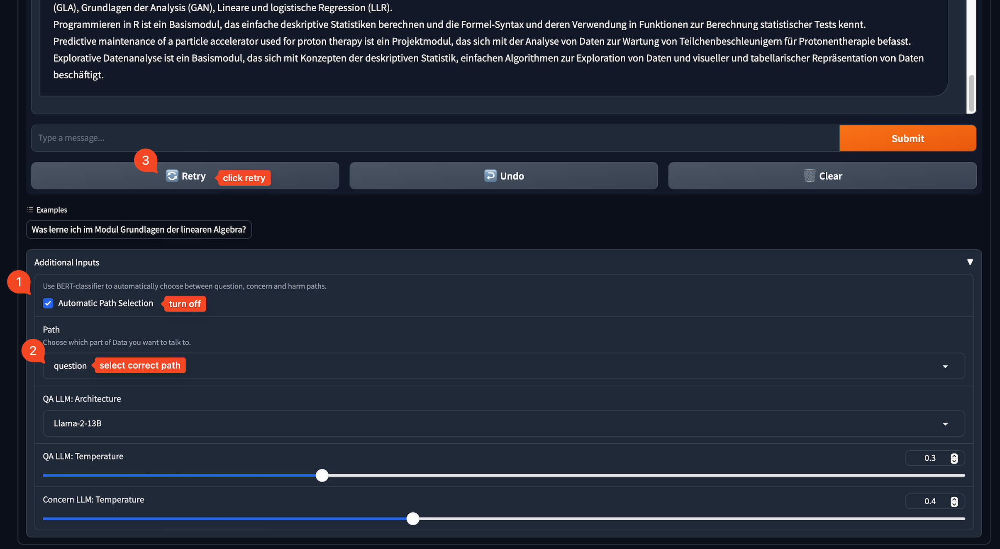

# Chatbot Data 🤖

This repository hosts the implementation of our Chatbot Data. It is based on a Gradio Dashboard.

## Repository Structure

The repository is structured as follows:

```markdown
└── 📁Study-Bot
    └── .env.template [ℹ️ Template for the .env file]
    └── README.md
    └── requirements.txt
    └── 📁assets [ℹ️ Assets used in README.md and docs]
    └── 📁docs [ℹ️ Contains our documentation markdowns]
    └── 📁src
        └── .DS_Store
        └── README.md
        └── 📁assets [ℹ️ Assets used in the Gradio Dashboard]
            └── ...
            └── 📁chroma [ℹ️ ChromaDB Vector Store with all Chunks]
            └── embedder.pkl [ℹ️ Embedder used for retrieval querying]
        └── dashboard.py [ℹ️ Gradio Dashboard Script]
        └── 📁flagged [ℹ️ Results flagged in Gradio]
        └── tools.py
```

## Setup

### Prerequisites

1. **Clone the Repository**: Clone this repository to your local machine.
2. **Python Environment**: Create a new virtual Python environment to ensure isolated package management (we used Python 3.11.6).
3. **Installation**: Navigate to the repository's root directory and install the required packages:
   ```bash
   pip install -r requirements.txt
   ```

### Configuring Environment Variables

1. **Environment File**: Copy `.env.template` to a new file named `.env`.
2. **API Keys**: Add your API keys and tokens in the `.env` file:
   ```
   HF_ACCESS_TOKEN=your-token-here
   OPENAI_API_KEY=your-key-here
   ```
   Replace `your-token-here` and `your-key-here` with your actual Hugging Face and OpenAI API keys.

### Running the Chatbot Data 🤖

Make sure to add the current embedder as `embedder.pkl` and the chroma vector db folder `chroma` produced by the DVC pipeline in the [Question Answering] (https://github.com/NLP-Challenges/llm-qa-path) repository to `src/assets/` before running the dashboard. 

Then, to run the dashboard, execute the following command:

```bash
python src/dashboard.py
```

This will load all required models onto the GPU and start the Gradio dashboard. You can now access the dashboard at `http://localhost:7860/`, or the public link provided in the terminal.

## Using Data

### Automatic Path Selection

If `Data 🤖` responds going the wrong path (question, concern), you can follow the instructions below to overwrite the `Automatic Path Selection`and re-generate the response.


