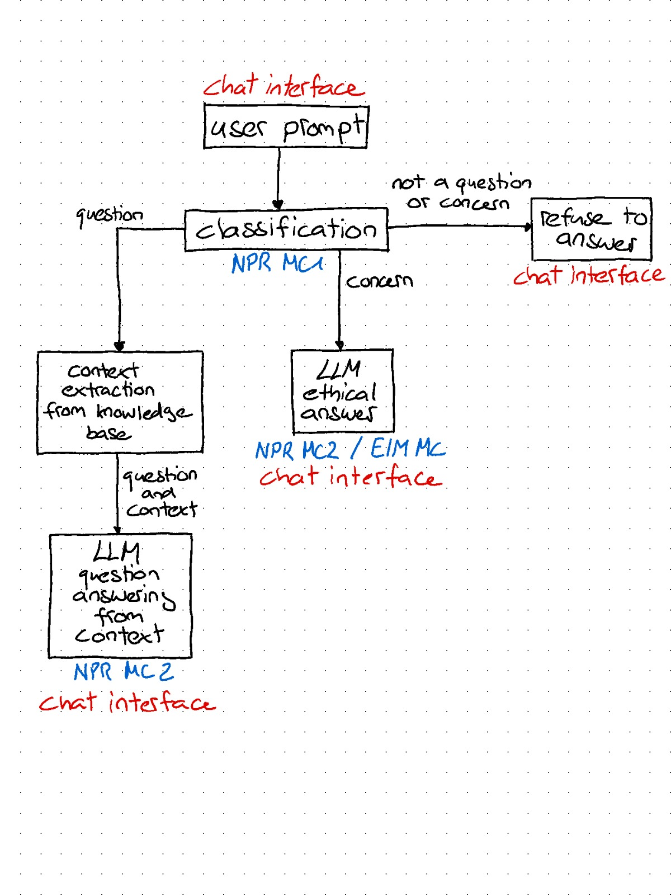

# Konzept für den Chatbot Data

Team:

- Tobias Buess
- Yvo Keller
- Alexander Shanmugam

## Ziel

Ziel dieser Challenge ist die Entwicklung des Chatbots namens Data. Er soll den Studenten vom Studiengang Data Science zur Verfügung stehen, und ihnen Fragen rund um den Inhalt der Spaces zu den Modulen beanworten können, wobei er eine Persönlichkeit besitzen und vorgegebenen ethischen Leitlinien folgen soll. Data soll auf die Inhalte der Modul-Spaces zugreifen und Standardanfragen mit Hilfe einer Wissensbasis beantworten können.

Der Bot soll auch Probleme des Benutzers erkennen und darauf moralisch adäquat reagieren, zum Beispiel mit aufmunternden Worten oder mit der Weitergabe an eine Ansprechperson. Er soll zudem zur Motivation der Studierenden beitragen.

Wir legen unseren Fokus in der Challenge darauf, eine Version des Bots zu bauen, die gut auf Deutsch funktioniert (Sprache der meisten Inhalte in der Wissensbasis). Dabei ist nicht ausgeschlossen, dass er auch auf Englisch funktioniert, aber wir werden uns nicht explizit darauf fokussieren.

## Fähigkeiten des Bots

Folgende Informationen soll der Bot auf Anfrage bereitstellen können:

- Seine Fähigkeiten erläutern
- Details zum Aufbau des Studiengangs (Konzept, Handbuch, Curriculum, Reglement)
- Details zum Modul
  - Fachexperten
  - Sprache
  - ECTS
  - Typ
  - Level
- Inhalte des Tabs "Porträt" der Module
- *optional*:
  - Wissen aus den PDFs in den Lernmaterialien der Module bereitstellen
  - Lernmaterialien vorschlagen
  - Tab "Aufgaben"

In seinem Verhalten soll der Bot folgende Persönlichkeitsaspekte berücksichtigen:

- Die Benutzer duzen (wie im SG Data Science üblich)
- Ethisch und moralisch korrekt sprechen (gerecht, wertschätzend)
- Eine motivierende, humorvolle und empathische Persönlichkeit besitzen
- Einen Dialog mit dem Benutzer führen können und über seine eigene Geschichte Bescheid wissen
- Auf Probleme des Users adäquat reagieren, wenn er diese erkennt (z.B. Stress im Studium, Unzufriedenheit, depressive Phasen) und Kontaktinformationen von Ansprechpersonen bereitstellen

### Was der Bot NICHT können soll

- Mehrsprachigkeit explizit unterstützen
- Auf Inhalte der Lernmaterialien zugreifen können (z.B. PDFs oder externe Links)
- Wir werden im abgesteckten Rahmen der Challenge keinen direkten Aufwand in die Verhinderung von Prompt Injection u.ä. investieren

## Wissensbasis

Die Wissensbasis des Bots soll auf mehreren Quellen aufbauen. Dies sind die zur Bereitstellung seiner Fähigkeiten notwendigen Informationen, einerseits aus dem Spaces DB Dump, andererseits aus den PDFs zum Studiengang (Konzept, Handbuch, Curriculum und Reglement).

Dabei soll der Bot bei der Beantwortung der Fragen den mitgeliefierten Kontext priorisieren. Wird eine Frage gestellt, die der Bot nicht auf Basis vom vorhandenen Kontext aus der Wissensbasis beantworten kann, deklariert er dies und greift zur Beantwortung der Anfrage entweder auf das Wissen im LLM zurück (z.B. bei "Was ist eine lineare Regression?"), oder lehnt die Beantwortung der Anfrage ab.

Die Inhalte können in Deutsch wie auch in Englisch vorhanden sein, was wir bei der Entwicklung berücksichtigen.

## Design

Wir gestalten einen Avatar für "Data", der im Chat Interface angezeigt wird.

- Avatar Bild
- *optional*: Synthetische Stimme

## Architektur & Tech Stack

Der nachfolgenden Skizze kann die geplante Architektur entnommen werden. Die einzelnen Komponenten werden im Folgenden kurz erläutert, wobei Änderungen an der Architektur oder der eingesetzten Technologien im Verlauf der Challenge nicht ausgeschlossen sind.

### Chat Interface

Der Bot steht dem Nutzer in einem simplen Web Chat Interface zur Verfügung. Dieses wird mit Streamlit umgesetzt. Die Logik zur Verarbeitung von Anfragen durch den Bot bauen wir mit Python, wobei wir LangChain verwenden um mit den verschiedenen LLMs zu kommunizieren.

Tech Stack:

- Chat Interface mit Streamlit (alternativ Gradio von HuggungFace)
- *voraussichtlich*: LangChain (Für Embedding und Kommunikation mit LLMs)

### Prompt Classification (auch: npr MC1)

Der Bot unterscheidet an erster Stelle zwischen 3 Arten von Anfragen:

- question
- concern
- not a question or concern

Mögliches Vorgehen:

- In einem Experiment evaluieren, wie viele Trainingsdaten benötigt werden, bis das Modell eine gute Performance in der Klassifikation erreicht
- Fine-tunig eines BERT-Modells zur Klassifikation der User Prompt

Tech Stack:

- HuggingFace Transformers library
- LLM: [BERT Base Multilingual](https://huggingface.co/bert-base-multilingual-cased) or similar

### LLM für "concern" (auch: npr MC2 und eim MC)

Der Bot geht auf die Anliegen des Users ein, wenn er diese erkennt. Er soll dabei empathisch und motivierend reagieren, und dem User bei Bedarf Kontaktinformationen von Ansprechpersonen bereitstellen.

Mögliches Vorgehen:

- Fine-tuning eines LLAMA2-Modells auf die ethischen Leitlinien für die Beratung und Unterstützung des Users im Bezug auf sein Anliegen.

Tech Stack:

- HuggingFace Transformers library
- LLM: [LLAMA2-13B-Chat](https://huggingface.co/meta-llama/Llama-2-13b-chat-hf) or similar

### LLM für "question" (auch: npr MC2)

Der Bot beantwortet die Frage des Users, wenn er sie versteht und die Antwort in der Wissensbasis vorhanden ist. Ansonsten lehnt er die Beantwortung der Frage ab, oder weist den User darauf hin, dass in der Wissensbasis dazu nichts vorhanden ist, und versucht mit internem LLM-Wissen weiter zu helfen.

Mögliches Vorgehen:

- Chunking und Embedding des Kontexts in der Wissensbasis.
- Fine-tuning/Instruction-tuning eines LLAMA2-Modells auf die Beantwortung der Fragen aus gegebenem Kontext.

Tech Stack:

- Embeddings (BERT/Open AI)
- Vector Storage [PGVector](https://github.com/pgvector/pgvector)
- HuggingFace Transformers library
- LLM: [LLAMA2-13B-Chat](https://huggingface.co/meta-llama/Llama-2-13b-chat-hf) or similar

## Zielgruppe

Die Zielgruppe des Bots sind die Studierenden des Studiengangs Data Science. Wir haben zwei Personas definiert, die die Zielgruppe repräsentieren.

### Persona 1: Anna, die eifrige Studentin

#### Demografische Daten

- Alter: 23
- Geschlecht: Weiblich
- Beruflicher Hintergrund: Lehre als Informatikerin

#### Persönlichkeit

- Ehrgeizig und fokussiert
- Detailorientiert
- Liebt es, frühzeitig zu planen

#### Bedürfnisse und Ziele

- Will den besten Überblick über ihre Module haben
- Sucht immer nach zusätzlichen Ressourcen für bessere Lernerfolge
- Möchte auf dem Laufenden bleiben, was Änderungen im Curriculum betrifft

#### Nutzungsszenarien

- Fragt den Bot nach den Leistungsnachweisen in spezifischen Modulen
- Will wissen, welche Fachexperten für ein Modul zuständig sind
- Plant das nächste Semester und fragt den Bot nach Modulen im Curriculum
- Wird vom Bot für ihre gute Arbeit gelobt und fühlt sich motiviert

### Persona 2: Markus, der berufstätige Student

#### Demografische Daten

- Alter: 29
- Geschlecht: Männlich
- Beruflicher Hintergrund: Arbeitet Teilzeit im Rechnungswesen

#### Persönlichkeit

- Pragmatisch und zielorientiert
- Legt Wert auf Work-Life-Study-Balance
- Etwas stressanfällig aufgrund der vielen Verpflichtungen

#### Bedürfnisse und Ziele

- Sucht nach einem effizienten Weg, die Studieninformationen zu konsultieren
- Will möglichst wenig Zeit mit der Suche nach grundlegenden Informationen verbringen
- Sucht nach einer schnellen Möglichkeit, seine Fragen zu klären, um sich auf seine Arbeit und das Studium zu konzentrieren

#### Nutzungsszenarien

- Will schnell wissen, wie viele ECTS ein Modul hat
- Möchte erfahren, was ihn in einem spezifischen Modul erwartet
- Nutzt die motivierenden und empathischen Funktionen des Bots, um Stress abzubauen

Diese Personas können als Grundlage für die Entwicklung des Chatbots "Data" dienen. Sie repräsentieren die Bedürfnisse und Ziele der Zielgruppe und können dazu beitragen, die Funktionalität und das Verhalten des Bots optimal auszurichten.

## Privatshpäre

Wir nutzen unsere eigenen fine-tuned Modelle, dementsprechend verlassen keinerlei sensible Daten unser System. Der Chatbot ist nur für Studenten des Studiengangs Data Science zugänglich, und damit sind auch nur Informationen verfügbar, auf die die Studenten ohnehin Zugriff haben.

## Evaluierung

Ein Chatbot, der falsche Antworten gibt, oder nicht auf die Fragen des Benutzers eingeht, ist nicht hilfreich. Er soll deshalb auf verschiedene Arten evaluiert werden.

### Prompt Classification

Quantitativ:

- F1-Score
- Accuracy

Qualitativ:

- Indiduelle Beispiele testen auf mehreren Modellen für Vergleich

### LLM für "concern"

Quantitativ:

- Nicht geplant

Qualitativ:

- Individuelle Beispiele, um zu testen, ob der Bot den ethischen Leitlinien folgt

### LLM für "question"

Quantitativ:

- Retrieval (Werden die relevanten Chunks identifiziert)
- BLEU Score (Wie gut ist die Antwort)

Qualitativ:

- Individuelle Beispiele, um die Brauchbarkeit der Antworten zu testen
