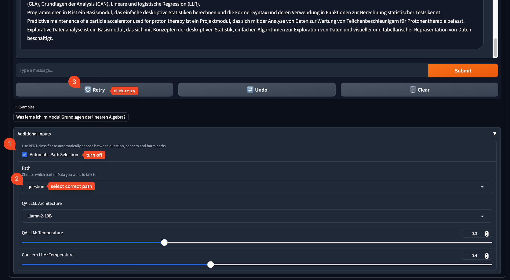

#  Dashboard

Make sure to add the current embedder as `embedder.pkl` and the chroma vector db folder `chroma` to assets, before running the dashboard.

## Using Data

### Automatic Path Selection

If `Data 🤖` responds going the wrong path (question, concern), you can follow the instructions below to overwrite the `Automatic Path Selection`and re-generate the response.

